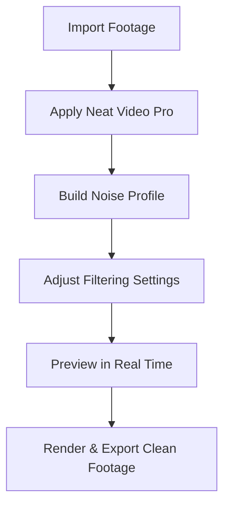

# Neat Video Pro – Advanced Noise Reduction for Filmmakers

**Neat Video Pro** is a high-quality video noise reduction plugin designed for editors, colorists, and filmmakers. Built with advanced temporal and spatial filtering, it delivers **crystal-clear footage** even when shot in low light, high ISO, or challenging environments.

Whether you’re editing wedding films, YouTube videos, documentaries, or cinematic projects, Neat Video Pro helps you achieve **professional-grade image clarity** without sacrificing detail.


---

## 🔎 Overview

Noise is one of the most common issues in digital video production. **Neat Video Pro** solves this by analyzing the noise profile of your footage and applying intelligent filtering. Unlike basic denoisers, it preserves edges, textures, and fine detail for a **natural and sharp image**.

It integrates directly with your editing software, offering flexible controls for:

* Noise profiling
* Temporal filtering across frames
* Sharpening & detail recovery
* Real-time preview

---

## ✨ Key Features

* **Adaptive Noise Profiling:** Automatically builds a noise profile from your clip.
* **Spatial & Temporal Filtering:** Reduces noise frame by frame while tracking movement.
* **Fine Detail Preservation:** Maintains sharpness in hair, skin, and textures.
* **Optimized Performance:** Multi-core CPU and GPU acceleration.
* **Custom Presets:** Save profiles for different cameras and shooting conditions.
* **Real-Time Preview:** Immediate feedback before applying final render.

---

## ⚡ Setup & Workflow

1. Install Neat Video Pro via the official installer.
2. Apply the effect to your noisy clip in your NLE.
3. Use the **Auto Profile** tool to analyze a flat/noisy area of the footage.
4. Adjust temporal and spatial settings to taste.
5. Preview before final rendering.
6. Export with noise-free, crisp results.

Example settings:

```plaintext
Noise Reduction Amount: 65%  
Temporal Radius: 3 frames  
Sharpening: +15%  
Artifact Removal: Enabled  
```

---

## 📊 Workflow Diagram



---

## ❓ FAQ

**Q: Will Neat Video Pro make my footage soft?**
A: No, when used correctly it preserves detail while removing noise. You can fine-tune sharpness controls.

**Q: Is it GPU accelerated?**
A: Yes, it supports CUDA and OpenCL for faster rendering.

**Q: Can I use it on 8K footage?**
A: Yes, Neat Video Pro handles up to 8K with optimized performance.

**Q: Do I need to build a noise profile for every clip?**
A: Not always. Profiles can be reused for footage shot under similar conditions.

---

## 🚀 Final Thoughts

**Neat Video Pro** is the industry-standard plugin for noise reduction, trusted by professional editors worldwide. By combining **powerful filtering algorithms, GPU acceleration, and user-friendly controls**, it ensures your footage stays sharp, clean, and cinematic.
